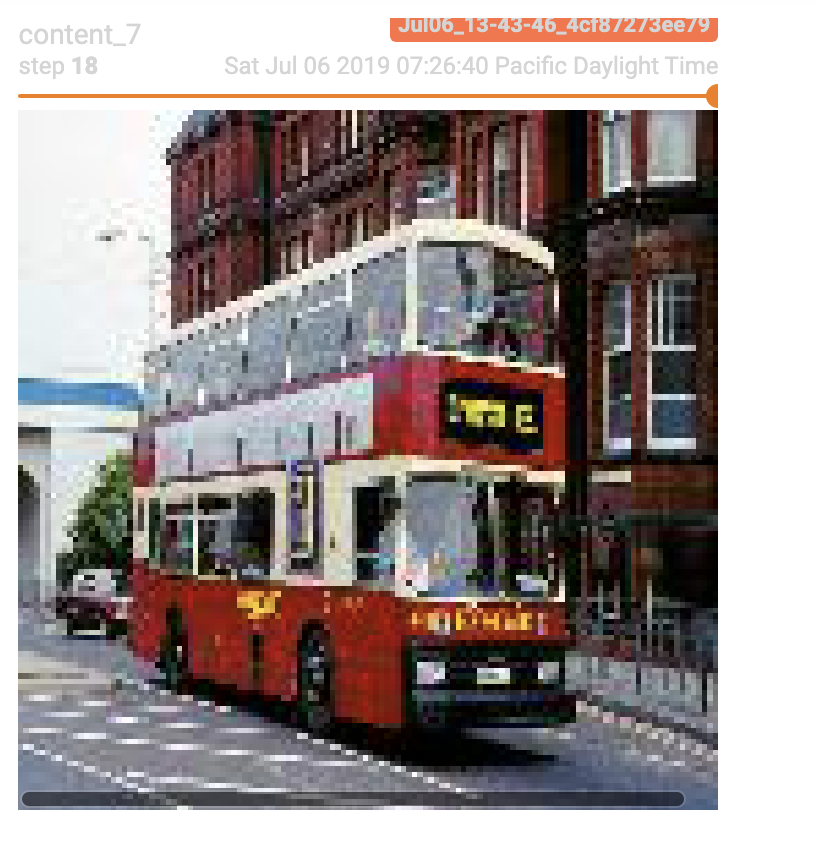
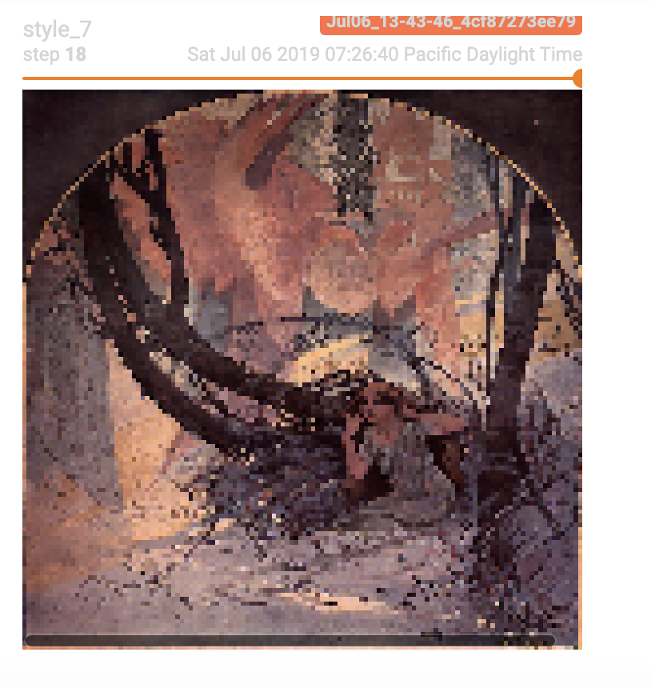
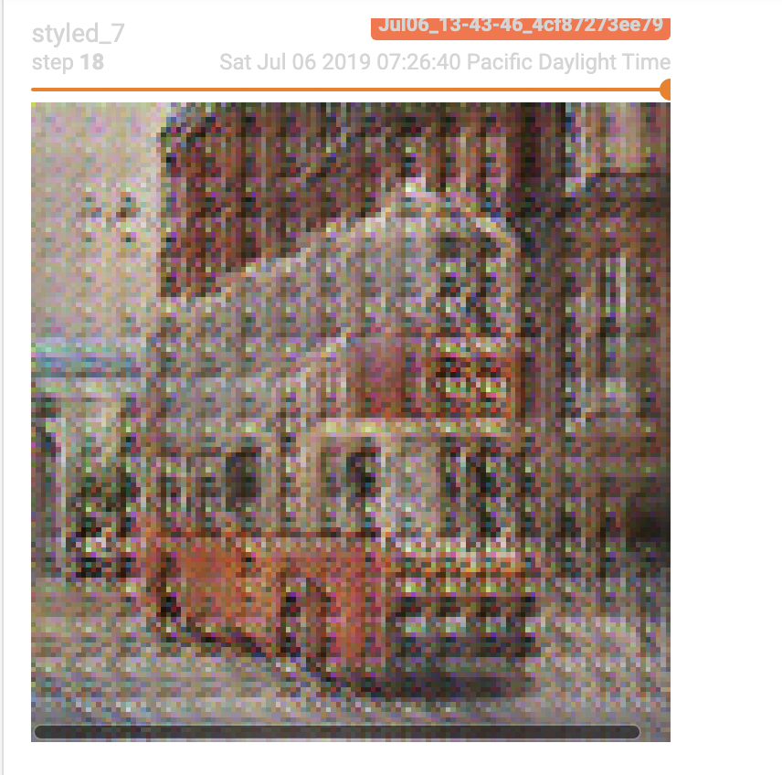

# Neural Style Transfer with Pytorch
## Introduction
In this repository, I implemented a neural network that can transfer the style of an arbitrary image to another photo.
Much of the code iThe training procedure can be found in [here](https://github.com/nhatsmrt/nn-toolbox/blob/experimental/nntoolbox/vision/learner/style.py) /
## Issues
The biggest issue I still have to deal with is checkerboard artifacts (see results section)
## Some results

