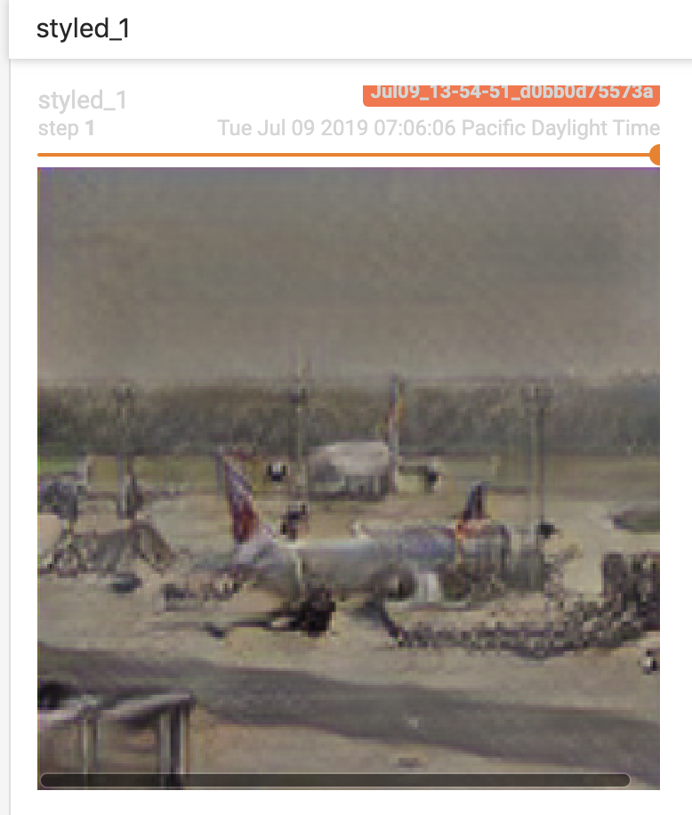

# Neural Style Transfer with Pytorch
## Introduction
Implementation of a neural network that can transfer the style of an arbitrary image to another photo.
 
Much of the code (e.g the layers) is implemented in my [neural network toolbox](https://github.com/nhatsmrt/nn-toolbox/blob/experimental/). The training procedure can be found [here](https://github.com/nhatsmrt/nn-toolbox/blob/experimental/nntoolbox/vision/learner/style.py). This repository contains only the testing code. To replicate my work, please also clone the experimental branch of my nntoolbox repository.
## Issues
It seems to work pretty well on resized COCO data (even on untrained/unseen photos), but does not generalize that well too random photos. I suspect the problems lie in resolution discrepancy. Or maybe I just haven't trained for long enough (although in my experiment the quality of the images seem to degrade as I trained more and more).
## Some results
I train the thing for 850 iterations, using COCO dataset (resize to 256 for each size), and the train_9 subset of the wikiart dataset. For each dataset, I split 80% of them as training data and use the rest for evaluating. I train the network for a total of 850 iterations (1 "epoch"). This is the result:
### Kinda Successful:
  
 
  
### Less So:

 
(Content image source: https://www.pexels.com/photo/cat-whiskers-kitty-tabby-20787/)
## Resources

1. <em>Xun Huang, Serge Belongie.</em> Arbitrary Style Transfer in Real-time with Adaptive Instance Normalization: https://arxiv.org/abs/1703.06868
2. Art images are from WikiArt.org. All images are protected by copyright and utilize the images only for the purposes of data mining, which constitutes a form of fair use.
Data can be download from: https://www.kaggle.com/c/painter-by-numbers/data
3. COCO dataset: http://cocodataset.org/#download
Licensed under a Creative Commons Attribution 4.0 License.
4. All test images are either from the COCO dataset, except for the cat photo.
